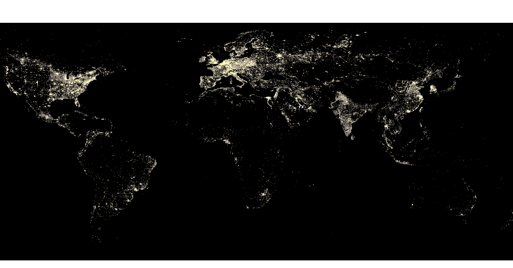

# For the covid19 SpaceAppsChallenge

## SpaceAppsChallenge Official pages
- https://www.spaceappschallenge.org/

## Challenge theme is『Light the Path』
- https://covid19.spaceappschallenge.org/challenges/covid-challenges/light-path/details

## We are here
- https://covid19.spaceappschallenge.org/challenges/covid-challenges/light-path/teams/geojackass/project

## Summary
It has become clear that the intensity of night light acquired by satellites is correlated with social and economic indicators such as gross domestic product, employment, population, and education in each country. In this project, I first describe the method of calculating the night light intensity in Japan by prefecture and city. Based on the results of the various analyses, we are predicting for economic damage caused by corona using Night Light.